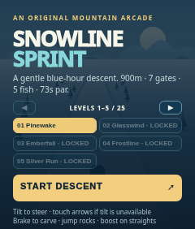
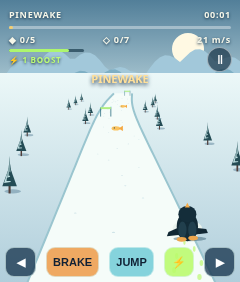
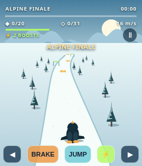
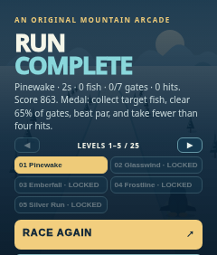

# Snowline Sprint

An original, offline-capable portrait downhill arcade game for the Rabbit R1's 240 × 282 browser. The chase view draws Tux belly-down, sliding away from the camera toward the slope; no third-party game assets are bundled. Inspired by the visual character and mechanics of [Tux Racer · Alpine](https://tux-racer-alpine-reborn.geekthegreybeard.chatgpt.site/), not an official Tux Racer product.

## Play and install

[Play the 25-level release](https://geekthegreybeard.github.io/r1-tux-racer/?release=20260927-25-levels). On R1, open **Creations card → Create tab → Add via QR code** and scan the release-specific Creation card QR below. Physical R1 installation is unverified.

## Actual 240 × 282 browser screenshots

| Menu | Level 1 race | Level 25 race | Result |
|---|---|---|---|
|  |  |  |  |

The level-25 screenshot uses a test-only unlocked browser storage state. Results are fast-forwarded to exercise the screen; these screenshots do not establish a human-played clear.

## Campaign and controls

There are **exactly 25 named, sequentially unlocked levels**, Pinewake through Alpine Finale. Every next level is 90 metres longer and has one more gate; fish targets rise, slopes bend more, the track narrows, gate offsets widen and par time per metre decreases. The five-page level picker shows five stages at a time, with locked stages disabled. The final descent measures 3,060 metres, with 31 gates and a 20-fish target. A medal unlocks the next level: collect target fish, clear at least 65% of gates, finish within par and take fewer than four hits. Unlocks persist in local storage where available. The final medal completes the campaign without inventing another stage.

Tilt left/right to steer, calibrated at each race start; touch arrows override tilt when held and work if sensors are unavailable. Hold BRAKE to carve, tap JUMP to clear rocks, and tap ⚡ to spend a boost charge. Keyboard: arrows or A/D, S/down to brake, Space to jump, W/up to boost, Escape to pause. Fish restore stamina; rocks slow Tux and drain stamina; green pickups replenish boost charges. The edge slows Tux. Short synthesized audio cues start after interaction.

## Test and implementation notes

Run `npm test` and `npm run test:browser` after `npm install` and `npx playwright install chromium`. Node tests check deterministic layouts, mechanics, all 25 distinct stage specifications, monotonically increasing distance and gate counts, finishability and medal feasibility under a clean-race benchmark. Browser tests exercise 240 × 282 rendering, touch steering, jumping, boosting, pause/resume, results, a qualifying unlock persisted across reload and level-25 selection/start; they write the screenshots above and `screenshot-level25-menu.png`. The browser results fast-forward is **not** a manual balance clear. On-device R1 sensor mapping, touch ergonomics, installation, audio and sustained frame rate remain unverified.

This is a compact 2D single-player canvas game, not the PC reference's expansive 3D terrain or multiplayer. The terrain, character, scenery and sound are procedural and original; no PC artwork, code or media was copied. Host the directory with `python3 -m http.server 8000` and open `http://localhost:8000/` for local play. Browser storage may be disabled, in which case unlocks last only for the current session.
