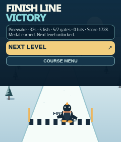

# Snowline Sprint

An original portrait downhill arcade game for the Rabbit R1's 240 × 282 browser. Tux races belly-down toward the finish against three penguin rivals on 25 progressively longer alpine courses. No third-party game assets are bundled. Inspired by [Tux Racer · Alpine](https://tux-racer-alpine-reborn.geekthegreybeard.chatgpt.site/), not an official Tux Racer product.

## Play and install

[Play this release](https://geekthegreybeard.github.io/r1-tux-racer/?release=20260927-rivals-finish-wheel). On R1, open **Creations card → Create tab → Add via QR code** and scan this installation QR from another screen. It encodes the five-field Creation metadata JSON, **not just a URL**, following [Rabbit's Creations SDK QR generator](https://github.com/rabbit-hmi-oss/creations-sdk/tree/main/qr). Its decoded JSON matches [`snowline-sprint-r1-card.json`](snowline-sprint-r1-card.json). Physical R1 installation remains unverified.

## Actual 240 × 282 browser screenshots

| Menu | Race | Finish | Victory / next level | Level 25 |
|---|---|---|---|---|
|  |  |  |  |  |

The level-25 screenshot uses test-only unlocked storage. Result screenshots fast-forward or set qualifying race data to exercise the finish screen; they do not establish a human-played clear.

## Controls and race

Tilt left/right to steer, calibrated at race start. Touch arrows override tilt and work without sensor events. **Double-tap the playfield anywhere outside buttons and menus to jump**; JUMP remains a one-tap fallback. An upward wheel event releases braking and requests a charged boost; a downward wheel event engages persistent braking. The HUD shows COAST, BOOSTING or BRAKING, remaining boost charges, metres to finish, place out of four and the nearest rival's lead or gap. With no physical wheel event, use ⚡ to boost and hold BRAKE to slow; keyboard W/up boosts, S/down brakes, Space jumps, A/D or arrows steer, Escape pauses. Tap BRAKE once to release latched wheel braking if the wheel is unavailable; otherwise hold BRAKE to slow.

Fish refill stamina, green pickups refill boosts, rocks slow Tux, and the edge slows the run. The marked finish line approaches within the visible track, and crossing freezes the player **at the line** under a result card with placing, medal and score. Three deterministic rivals travel the same course independently, with per-level pace and visible relative placement. First place **and** the existing medal criteria unlock the next level: target fish, at least 65% of gates, par time and fewer than four hits. NEXT LEVEL advances immediately on victory; RACE AGAIN and COURSE MENU cover other outcomes. All 25 named levels, pickups, scoring and persisted sequential unlocks remain. The final medal finishes the campaign without adding a 26th level.

## Validation and limitations

Run `npm test` and `npm run test:browser` after `npm install` and `npx playwright install chromium`. Engine tests cover all 25 courses, rival progression, finishing and ranking. Browser tests exercise touch steering, double-tap separation from UI, simulated wheel directions, HUD, pause, finish hold, victory unlock, next-level action, persistent unlock and level 25 at 240 × 282. The screenshots are real Chromium renders, not R1 photos. A browser can consume standard `wheel` events, but [Rabbit's public Creations page](https://www.rabbit.tech/creations) does not document whether the embedded R1 runtime forwards its physical wheel as DOM `wheel`; tilt axis, wheel direction, device performance, on-device ergonomics, QR acceptance and sustained play balance all require a physical R1 check. Browser tests do not verify hardware. This is a compact 2D racer, not the reference game's 3D terrain or multiplayer, and is not a Gallery submission.
